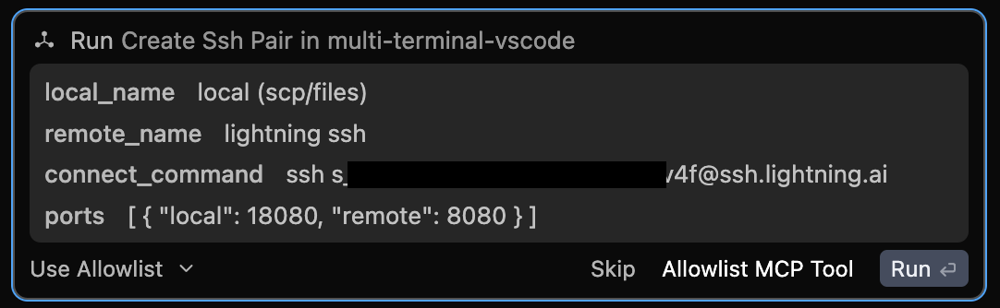
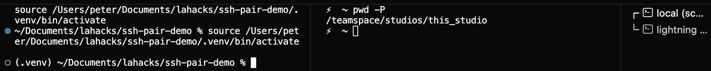
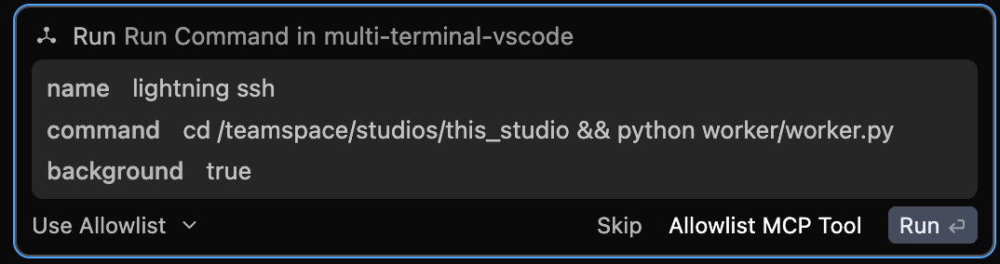
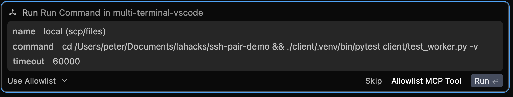
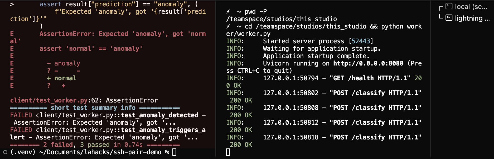

# Multi-Terminal Agent

Let AI coding agents control multiple named terminal sessions simultaneously via the [Model Context Protocol](https://modelcontextprotocol.io). The agent drives the terminals. You watch. Debug across client-server processes, remote SSH connections, and more! One agent in control means no agent communication nightmare.

**Contents**
- [VS Code extension](#vs-code-extension) ⭐
  - [How it works](#how-it-works)
  - [Setup](#setup)
- [tmux](#tmux)
  - [How it works](#how-it-works-1)
  - [Setup](#setup-1)
- [AGENTS.md](#agentsmd)
- [Use cases](#use-cases)
- [API (MCP Server Tools)](API.md)

---

Two implementations — pick one:

| | **VS Code extension** ⭐ recommended | **tmux** |
|---|---|---|
| Terminals visible in | Cursor terminal panel | tmux sessions in any terminal |
| Transport | HTTP (`localhost:3456`) | stdio |
| Requires | Cursor | tmux (`brew install tmux`) |

> **Windsurf Support Limitation:** The VS Code extension creates terminals via the VS Code Extension API, but Windsurf does not display those terminals in its UI — they run invisibly in the background. This is a Windsurf integration limitation, not a bug in the extension. In theory, the VS Code Extension should still work, but the terminal windows will not be visible in Windsurf.

## VS Code Extension

<details>
<summary><strong>Setup</strong></summary>

**1. Install dependencies and compile**
```bash
cd vscode
npm install
npm run compile
```

**2. Launch the extension**

Open the `vscode/` folder in your VS Code-compatible IDE and press **F5**. A new Extension Development Host window opens with a toast: _"Multi-Terminal: MCP server started on port 3456"_.

> For permanent use, package the extension as a `.vsix` (`vsce package`) and install it.

**3. Connect your agent**

**Claude Code** (`.claude/settings.json` or `~/.claude/settings.json`):
```json
{
  "mcpServers": {
    "multi-terminal": {
      "type": "http",
      "url": "http://localhost:3456/mcp"
    }
  }
}
```

**Cursor** (`~/.cursor/mcp.json`):
```json
{
  "mcpServers": {
    "multi-terminal": {
      "url": "http://localhost:3456/mcp"
    }
  }
}
```

</details>

### How it works

The extension starts a local MCP HTTP server on `localhost:3456` when VS Code activates. Terminals are created and managed inside VS Code's terminal panel — you see every command the agent runs in real time.

```
User: Create split ssh terminals using the following ssh command
ssh -L 18080:127.0.0.1:8080 s...f@ssh.lightning.ai
```

<div align="center">↓</div>


<br clear="left">

<div align="center">↓</div>



```
Run the `worker/worker.py` file on the remote machine.
Then run the `client/test_worker.py` on the local machine
```

<div align="center">↓</div>



<br clear="left">


<br clear="left">

<div align="center">↓</div>



```
User: The failures can be on the local client side or remote server side.
Please investigate both the local and remote machine and implement a fix.
```
<div align="center">↓</div>
<div align="center">...</div>

---

## tmux

<details>
<summary><strong>Setup</strong></summary>

**1. Install tmux**
```bash
brew install tmux   # macOS
# or: sudo apt install tmux
```

**2. Install dependencies and compile**
```bash
cd tmux
npm install
npm run compile
```

**3. Connect your agent**

**Claude Code** (`.claude/settings.json` or `~/.claude/settings.json`):
```json
{
  "mcpServers": {
    "multi-terminal": {
      "type": "stdio",
      "command": "node",
      "args": ["/absolute/path/to/multi-terminal-agent/tmux/out/index.js"]
    }
  }
}
```

</details>

### How it works

A standalone Node.js process that speaks MCP over stdio. It creates and manages named tmux sessions — attach to any of them with `tmux attach -t mta_<name>` to watch the agent work.

```
Agent (Claude Code / any MCP client)
    │  MCP tool calls (stdio)
    ▼
Node.js MCP server
    │  tmux CLI
    ▼
tmux sessions  ←  attach to watch
```

---

## AGENTS.md

Copy [`assets/AGENTS.md`](assets/AGENTS.md) into the root of any project where you want agents to use this MCP server. Claude Code, Cursor, and other agents automatically read `AGENTS.md` at the project root and follow its rules.

---

## Use cases

### Server + client iteration (e.g. database server + client)

When a bug requires recompiling a server and re-running a client test, a single-terminal agent gets stuck — it can't keep the server running while also running the client. With a terminal pair, the agent restarts the server in one pane and runs tests in the other, iterating freely without any manual intervention.

> **User:** "My tests are failing. Investigate, fix the bug, and confirm the test passes. Recompile and restart the server as many times as you need to."

```
# Create side-by-side terminals one for server and one for client
Agent: create_terminal_pair("server", "client")
# Start the database server
Agent: run_command("server", "./build/clickhouse-server", { background: true })
# Run the client or test
Agent: run_command("client", "./build/clickhouse-client --query 'SELECT ...'")
# Kill the old database server
Agent: send_input("server", "C-c")
... (agent makes a code change locally) ...
# Recompile source code and start the updated server
Agent: run_command("server", "ninja -C build && ./build/clickhouse-server", { background: true })
# Re-try the client or test
Agent: run_command("client", "./build/clickhouse-client --query 'SELECT ...'")
... (continues iterating if needed)
```

---

### Debugging across two machines via SSH (e.g. local + remote VM or local + docker container)

Cross-system bugs are hard to debug with a single agent because it can only see one side. With `create_ssh_pair`, one agent gets a local terminal and a remote terminal in the same session. It can serve as a single brain that is capable of inspecting and modifying both local and remote machines.

> **User:** "The app on staging is returning 500s. SSH into user@vm, check the logs, and fix whatever's broken. Deploy your fix when you're done."

```
# Open a local shell and an SSH shell side by side, forwarding port 8080
Agent: create_ssh_pair("local", "remote", "ssh user@vm", { remote_cwd: "/app", ports: [{remote: 8080, local: 8080}] })
# Check recent errors on the remote
Agent: run_command("remote", "tail -50 logs/error.log")
# → KeyError: 'user_id' in handlers/auth.py:34
# Read the offending file on the remote
Agent: run_command("remote", "cat handlers/auth.py")
# Write the fixed version of the file directly to the remote
Agent: write_remote_file("remote", "/app/handlers/auth.py", "<full fixed content>")
# Restart the app on the remote and verify it's healthy
Agent: run_command("remote", "systemctl restart app")
Agent: run_command("remote", "curl -s localhost:8080/health")
# → {"status": "ok"}
```

---

### Frontend + backend running concurrently

> **User:** "Start the backend and frontend, then figure out why the login form isn't submitting. Fix it and confirm it works."

```
Agent: create_terminal_pair("api", "web")
Agent: run_command("api", "cd backend && npm start", { background: true })
Agent: run_command("web", "cd frontend && npm run dev", { background: true })
... (agent makes a code change) ...
Agent: send_input("api", "C-c")
Agent: run_command("api", "cd backend && npm start", { background: true })
```

---

## API (MCP Server Tools)

Full tool reference for agents and MCP clients: **[API.md](API.md)**
